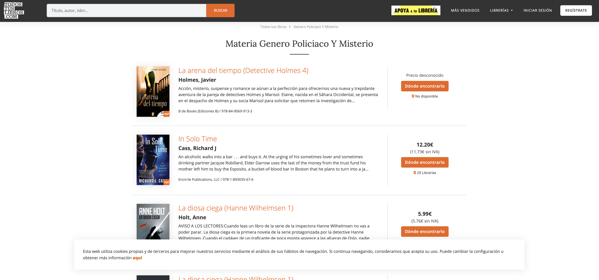
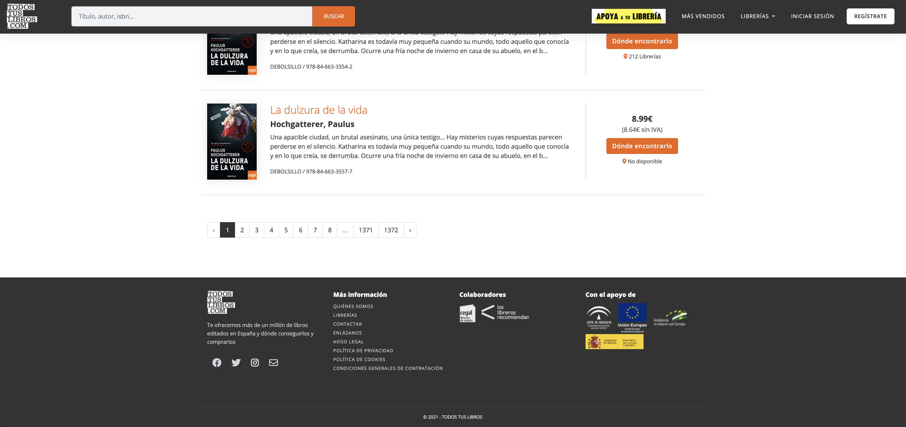
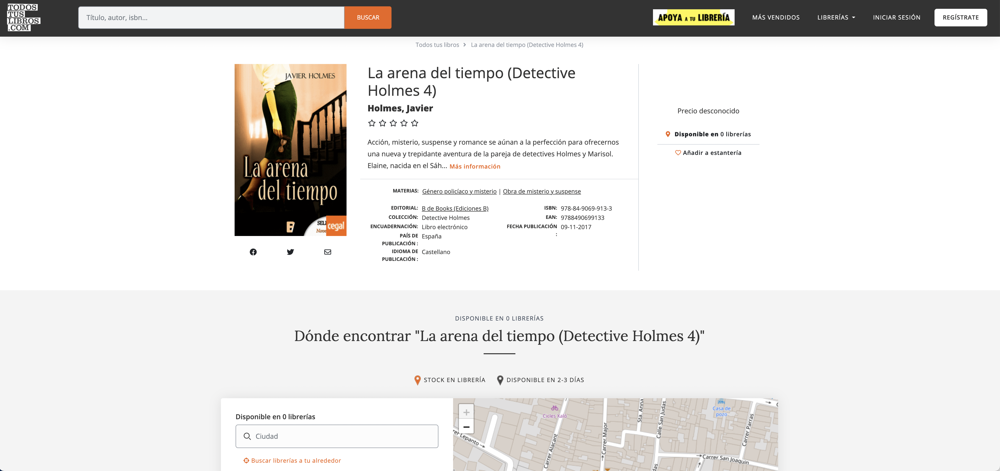

- [:books: Book data crawling](#books-book-data-crawling)
  - [Business case](#business-case)
    - [Book data sources](#book-data-sources)
  - [Site details: www.todostuslibros.com](#site-details-wwwtodostuslibroscom)
    - [Searches by genre and book details](#searches-by-genre-and-book-details)
    - [Crawler config](#crawler-config)
    - [Output data](#output-data)
  - [Getting Started](#getting-started)
    - [Dependencies](#dependencies)
    - [Setup](#setup)
  - [Authors](#authors)
  - [Version History](#version-history)
  - [License](#license)
  - [Acknowledgments](#acknowledgments)
# :books: Book data crawling

Book data crawling with [Scrapy](https://docs.scrapy.org/en/latest/index.html) from several websites, starting with www.todostuslibros.com and moving on to other complementary book information sources in the near future.

## Business case

I am a book lover and, most of all, I am passionate about fiction, so I decided this interest of mine could be the spark for a data science pet project, where I could build the end-to-end ETL and analysis pipelines and go on extracting some interesting insights about books, apart from reading (and enjoying) them.

This repo is the first part of the project and it includes the Scrapy code for crawling the data and storing it in JSON files. See more about the exploratory data analysis and machile learning models related to book data in my other repo [ermine-book-data-analysys](https://github.com/ladywithanermine/ermine-book-data-scraping).

### Book data sources

There are few book-related datasets around. Some are in [Kaggle](https://www.kaggle.com/datasets), such as [this one](https://www.kaggle.com/sootersaalu/amazon-top-50-bestselling-books-2009-2019) or [this other one](https://www.kaggle.com/tanguypledel/science-fiction-books-subgenres). They are mostly related to genre fiction or Amazon book data in English. I have found no datasets related to books solely in Spanish or to the Spanish book market, so I decided to gather the data by myself and learn a few new things in the process. 

The selection of suitable sites to retrieve book data for books published in Spain is quite reduced, more so since the [Goodreads API](https://www.goodreads.com/api) was deprecated in December 2020. [Amazon](https://www.amazon.es/gp/browse.html?node=599364031&ref_=nav_em__abks_0_2_11_2) is of course a great data source with, reviews, categories and other relevante information, but their protection against third-party crawlers makes the task of gathering the data difficult enough to not consider it as a first option for this learning project.

Among the rest of the book-related sites, one the most straightforward is [Todos tus libros](http://www.todostuslibros.com), a site put up by [Cegal](https://www.cegal.es/), the Spanish bookshops association, to publicize books and their availability, as part of a campaign to encourage readers to buy locally. The site (as stated in the ['Who we are'](https://todostuslibros.com/servicios/quienes_somos) section) includes information (sometimes incomplete) on more than 4 million books --and counting.

The Spanish Ministry of Culture has a [ISBN database](http://www.mcu.es/webISBN/tituloSimpleFilter.do?cache=init&prev_layout=busquedaisbn&layout=busquedaisbn&language=es) that can be queried by ISBN number or by year interval, limited to 1000 results. It does not seem  that useful to actually gather bulk data, unless you are enriching book information collected elsewhere. An option would be to find out some way to auto-page the results and get over that 1000 books limit.

The Spanish Statistics National Institute also has information related to published books by year, but in this case it is aggregated data, so no individual details about the books are available in [their site](https://www.ine.es/dyngs/INEbase/es/categoria.htm?c=Estadistica_P&cid=1254735573113).

Book sales rankings are available, not only at www.todostuslibros.com, but also at several online bookshops' sites, such as [La casa del libro](https://www.casadellibro.com/libros/novedades-mes-2) or [Fnac](https://www.fnac.es/n710/Libros-mas-vendidos#bl=ACLibros-y-ebooksARBO), although there is no information regarding the ranking date or the update frequency. These big online bookshops could be al alternate source for crawling the data or, even, for additional information, such as book reviews. 

Taking everything into account, I have decided to create a first version of the crawler using www.todostuslibros.com and make my way towards other sites, one at a time. I will, in subsequent iterations, enrich the information with details from the ISBN database and reviews from La casa del libro, Fnac and possibly other sites. Further developments will include gathering top sales from several sites to create a unified ranking that may be refreshed periodically, in order to have time series information on sales and such.

## Site details: www.todostuslibros.com

The site allows searches on author, title, publishing house, ISBN or date of publication and books are tagged for one or more categories/genres ('materias'). The tags are somewhat diverse, including genres (mistery, romance) or, sometimes, even language (Español/Castellano, Inglés, etc.) and other custom labels. There appears to be no unified taxonomy or, rather, one that has evolved over time. For instance, some books are listed with 'Español' as original language, and others with 'Castellano', where both languages are in fact the same (Spanish).

### Searches by genre and book details

The scraping of a direct search URL, such as https://todostuslibros.com/busquedas?keyword=novela is not allowed by the website. Instead, in order to gather information on different genres, I have selected a list of genres based on several 'materias' URLs and grouped them as follows:

* Mistery and crime: 
  * https://www.todostuslibros.com/materia/genero-policiaco-y-misterio_FF
  * https://todostuslibros.com/materia/clasicos-policiacos_FFC
* Terror and suspense: 
  * https://www.todostuslibros.com/materia/obra-de-misterio-y-suspense_FH 
  * https://www.todostuslibros.com/materia/cuentos-de-terror-y-fantasmas_FK
* Fantasy: 
  * https://www.todostuslibros.com/materia/fantasia_FM
* Science fiction: 
  * https://www.todostuslibros.com/materia/ciencia-ficcion-clasica_FLC
  * https://todostuslibros.com/materia/ciencia-ficcion_FL
* Historical fiction: 
  * https://todostuslibros.com/materia/ficcion-historica_FV
* Romance: 
  * https://todostuslibros.com/materia/narrativa-romantica-adulta-y-contemporanea_FRD
  * https://todostuslibros.com/materia/narrativa-romantica_FR

It is important to notice that any book may be tagged under one or more 'materias' ('mistery' and 'fantasy', for instance). Thus, some books will appear in more than one of the previous searches. This is not a problem if the output files are analyzed separately, but it must be taken into account for duplicates if a joined analysis is performed (see my other repo [ermine-book-data-analysys](https://github.com/ladywithanermine/ermine-book-data-scraping) for more details about this).

Every search or 'materias' results list displays a page with 10 books and some basic information: author, title, book cover, publisher, ISBN, a few lines of the synopsis, price (if available), plus pagination links at the bottom of the page:





Clicking on a book, a detail page is displayed with information on tags, original language, country, number of pages, etc.:



### Crawler config

Every genre query (one or more URLs) is crawled independently and stored in a JSON file. The details of the base URLs for the crawling and the JSON feed export can be parametrized in the [settings.py](./todostuslibros/todostuslibros/settings.py) file, under the following variables:

```
 TODOSTUSLIBROS_URL_LIST # List of URLs for the crawling
 TODOSTUSLIBROS_BOOK_DETAIL_URL_TEMPLATE # Template for the book details page
 FEED_URI # Name of the JSON output file
```

### Output data 
The crawler retrieves the following information for the books included in the selected genres:

* Title
* Author(s)
* Publisher
* Synopsis
* Price (if available)
* Publishing country
* Publishing language
* Original language
* ISBN
* EAN
* Publication date
* Type of binding
* Number of pages
* Number of bookstores where the book is available (at the time of the dataset generation)
* Tags: a compendium of genre, language, style, etc.
* Book cover URL


## Getting Started

### Dependencies

This repo uses a pipenv virtual environment, so you'd either install [pipenv](https://pipenv-es.readthedocs.io) and recreate the environment or you may install a few python packages in your own python environment of choice to be able to run the crawler:

* scrapy

### Setup

1. Clone this repo (for help see this [tutorial](https://help.github.com/articles/cloning-a-repository/)).
2. Recreate the pipenv virtual environment using:
```
 pipenv sync --dev
```
3. Review the [settings.py](./todostuslibros/todostuslibros/settings.py) file in order to setup the custom search you want the crawler to run and the output file name or other feed export config. See more about other feed export formats [here](https://docs.scrapy.org/en/latest/topics/feed-exports.html) in the Scrapy documentation site.
    
4. Run the crawler within the pipenv virtual environment:
```
pipenv run scrapy crawl todostuslibros
```
In case you are running the repo under a standard Python installation (without a virtual environment), it would be enough to do the following:
```
scrapy crawl todostuslibros
```

## Authors

[@ladywithanermine](https://github.com/ladywithanermine)

## Version History

<!--* 0.2
    * Various bug fixes and optimizations
    * See [commit change]() or See [release history]()-->
1.0
    * Initial Release

## License

This project is licensed under the Creative Commons License - see the [LICENSE.md](LICENSE) file for details

## Acknowledgments

* [An inspirational post on how to setup a professional data science repository](https://towardsdatascience.com/how-to-create-a-professional-github-data-science-repository-84e9607644a2)
<!--Inspiration, code snippets, etc.
* [PurpleBooth](https://gist.github.com/PurpleBooth/109311bb0361f32d87a2)
* [dbader](https://github.com/dbader/readme-template)
* [zenorocha](https://gist.github.com/zenorocha/4526327)
* [fvcproductions](https://gist.github.com/fvcproductions/1bfc2d4aecb01a834b46)
-->